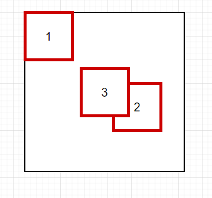

<!--
 * @Description: CSS基础知识
 * @author: kelly
 * @Date: 2023-09-19 21:51:59
 * @LastEditTime: 2023-09-22 23:17:33
-->

## 1、CSS 选择器及优先级

（1）选择器

- id 选择器（#myId）
- 类选择器（.myClass）
- 属性选择器（a[rel="external"]）
- 伪类选择器（a:hover，li:nth-child）
- 标签选择器（div，h1，p）
- 相邻选择器（h1 + p）
- 子选择器（ul> li）
- 后代选择器（li， a）
- 通配符选择器（\*）

（2）优先级

- ！important
- 内联样式（1000）
- ID 选择器（0100）
- 类选择器/属性选择器/伪类选择器（0010）
- 元素选择器/伪元素选择器（0001）
- 关系选择器/通配符选择器（0000）

带！important 标记的样式属性优先级最高；样式表的来源相同时：！important > 行内样式 > ID 选择器 > 类选择器 > 标签 > 通配符 > 继承 > 浏览器默认属性

## 2、position 属性的值有被那些及其区别？

（1）**固定定位 fixed**：元素的位置相对于浏览器窗口是固定位置，即使窗口是滚动的，她也不会移动。

fixed 定位使得元素与文档流无关，因此不占据空间。fixed 定位的元素和其他元素重叠。

（2）**相对定位 relative**：如果对一个元素进行相对定位，它将出现在它所在的位置上。然后，可以通过设置垂直或水平位置，让这个元素相对于他的起点进行移动。在使用相对定位时，无论是否进行移动，元素仍然占据原来的空间。因此，移动元素会导致它覆盖其他框。

（3）**绝对定位 absolute**: 绝对定位的元素的位置相对于最近的已定位的父元素，如果元素没有已定位的父元素，那么他的位置相对于 absolute 定位使元素的位置与文档流无关，因此不占空间。absolute 定位的元素和其他元素重叠。

（4）**粘性定位 sticky**：元素先按照普通文档流定位，然后相对于该元素在流中的 flow root（BFC）和 containing block（最近的块级祖先元素）定位。而后，元素定位表现为在跨越特定阈值前为相对定位，之后为固定定位。

（5）**默认定位 static**: 默认值，没有定位，元素出现在正常的流中（忽略 top,bottom,left,right 或者 z-index 声明）。inherit:规定应该从父元素继承 position 属性的值。

## 3、盒子模型

盒子模型：当对一个文档进行布局（layout）的时候，浏览器的渲染引擎会根据标准之一的 CSS 基础框盒模型，将所有元素表示为一个个矩形的盒子。

盒子模型分为两种，分别是 W3C 标准盒模型和 IE（怪异）盒模型。

W3C 标准盒模型：盒子的总宽（高）度 = width + padding + border + margin
IE（怪异）盒模型：盒子的总宽（高）度 = width + margin，（其中 width 包括 width+padding+border）

在 CSS 中有一个属性 box-sizing 用来控制浏览器的渲染使用哪一种盒子模型，

box-sizing 有三个属性：

- content-box：使用 W3C 标准盒模型
- border-box: 使用 IE 盒模型
- inherit: 继承父元素的类型

## BFC（块级格式上下文）

（1）是什么？

我们在页面布局时，经常会出现以下的情况：

- 这个元素高度怎么没了？
- 这两栏布局怎么没法自适应？
- 这两个元素的间距怎么有点奇怪？
- 。。。。

其实这些都是设计 BFC 的概念。

BFC（Block Formatting Context），即块级格式化上下文，它是页面中的一块渲染区域，并且有一套属于自己的规则：

- 内部的盒子会在垂直方向上一个接一个放置
- 对于同一个 BFC 的两个相邻的盒子的 margin 会发生重叠，与方向无关
- 每个元素的左外边距与包含块的左边界相接触（从左到右），即使浮动元素也是如此
- BFC 的区域不会与 float 的元素区域重叠
- 计算 BFC 的高度时，浮动子元素也参与计算
- BFC 就是页面上的一个隔离的独立容器，容器里面的元素不会影响到外面的元素，反之亦然。

BFC 的目的是**形成一个相对于外界完全独立的空间，让内部的子元素不会影响到外部的元素。**

（2）触发条件：

包括但是不限于以下

- 根元素，即 HTML 元素
- 浮动元素：float 设置为 left、right
- overflow 值不为 visible，为 auto、scroll、hidden
- display 的值为 inline-block、inline-table、inline-cell、table-caption、table、flex、inline-flex、grid、inline-grid
- position 为 absolute、fixed

（3）应用场景：

- 防止 margin 重叠（坍塌）

```js
<style>
  p {
    color: #f55;
    background: #fcc;
    width: 200px;
    line-height: 100px;
    text-align: center;
    margin: 100px;
  }
</style>

<body>
  <p>first</p>
  <p>second</p>
</body>
```

两个 p 之间的距离只有 100px，就是因为发生了 margin 重叠。如果其中一个 margin 为 80px，那么两个 p 之间的距离还是 100px，以最大的为准。

**同一个 BFC 的两个相邻盒子的 margin 会发生重叠。**

解决方案：可以在 p 外面包裹一层容器，并触发这个容器生成一个 BFC，那么就不会发生重叠了。（代码如下）

```js

<style>
  .wrap {
    overflow: hidden;// 新BFC
  }
  p {
    color: #f55;
    background: #fcc;
    width: 200px;
    line-height: 100px;
    text-align: center;
    margin: 100px;
  }
</style>

<body>
  <p>Haha</p>
  <div class="wrap">
    <p>Hehe</p>
  </div>
</body>

```

- 清除内部浮动

```js
<style>
  .par {
    overflow: hidden;
    border: 5px solid #fcc;
    width: 300px;
  }

  .child {
    border: 5px solid #f66;
    width: 100px;
    height: 100px;
    float: left;
  }
</style>

<body>
  <div class="par">
    <div class="child">child1</div>
    <div class="child">child2</div>
  </div>
</body>
```

BFC 在计算高度时，浮动元素也会参与，所以我们可以触发.par 元素生成 BFC，则内部浮动元素计算高度时也会计算。

```js
  .par {
    overflow: hidden; //加上这个生成BFC
    border: 5px solid #fcc;
    width: 300px;
  }

```

- 自适应多栏布局

```js
<style>
  body {
    width: 300px;
    position: relative;
    overflow: hidden;
  }

  .aside {
    width: 100px;
    height: 150px;
    float: left;
    background: #f66;
  }

  .main {
    height: 200px;
    background: #fcc;
  }
</style>

<body>
  <div class="aside"></div>
  <div class="main"></div>
</body>
```

上面会两个 div 会重叠。

因为每个元素的左外边距与包含块的左边界相接触（从左到右），浮动元素也是如此。

而 aside 是浮动元素，main 的左边依旧会与包含块的左边相接触，而 BFC 的区域不会与浮动盒子重叠。

因此，我们可以通过触发，main 生成 BFC，以此适应两栏布局。

```css
.main {
  overflow: hidden;
}
```

这个时候，新的 BFC 不会与浮动的 aside 元素重叠，因此会根据包含块的宽度和 aside 的宽度，自动变窄。

[拓展]

上面是两栏布局，那么如果是三栏布局呢？怎么利用 BFC 实现左右固定，中间自适应呢？

```js
<style>
  .left {
    width: 100px;
    height: 150px;
    float: left;
    background: #f66;
  }

  .main {
    overflow: hidden;
    height: 200px;
    background: #fcc;
  }

  .right {
    float: right;
    height: 300px;
    width: 200px;
    background: greenyellow;
  }
</style>

<body>
  <div class="left"></div>
  <div class="right"></div>
  <div class="main"></div>
</body>
```

## 3、响应式设计是什么？基本原理了解吗？

（1）是什么？

响应式网站设计是一种网络页面设计布局，页面的设计与开发应当根据用户行为以及设备环境（系统平台、屏幕尺寸、屏幕定向等）进行响应的响应和调整。（Content is like water）

常见特点：

- 同时适配 PC+平板+手机等
- 标签导航在接近手持终端设备时改变为经典的抽屉式导航
- 网站的布局会根据视口来调整模块的大小和位置

（2）实现方式

基本原理是：通过媒体查询检测到不同设备屏幕尺寸做了处理，为了处理移动端，页面头部必须有 meta 声明 viewport

```html
<meta
  name="viewport"
  content="width=device-width, initial-scale=1, maximum-scale=1,user-scalable=no"
/>
```

属性对应如下：

- width=device-width：自适应手机屏幕的尺寸宽度
- maximum-scale：缩放比例的最大值
- initial-scale：缩放的初始值
- user-scalable：用户可以缩放的操作

实现响应式布局的方式如下：

- 媒体查询
- 百分比
- vw/vh
- rem

**媒体查询**

CSS 中增加了更多的媒体查询，就像 if 条件表达式一样，我们可以设置不同类型的媒体条件，并根据对应的条件，给相应符合条件的媒体类型定义不同的样式表。

使用 @media 查询，可以针对不同媒体类型定义不同的样式

```css
@media screen and (max-width: 1920px) {
  ...;
}
```

当视口在 375px-600px 之间，设置特定字体的大小 18px:

```css
@media (min-width: 375px) and (max-width: 600px) {
  body {
    font-size: 18px;
  }
}
```

通过媒体查询，我们可以给不同分辨率的设备编写不同的样式来实现响应式布局，比如我们为不同分辨率的屏幕，设置不同的背景图片。

比如给小屏幕手机设置@2X 图，为大屏幕手机设置@3X 图，通过媒体查询就能很方便实现。

**百分比**

height、width 属性的百分比依托于父标签的宽高，其他属性则不完全依赖于父元素：

- 子元素的 top/left/bottom/right 设置的百分比，则是相对于直接非 static 定位（默认定位）的父元素的宽高
- 子元素的 padding：不论垂直还是水平方向，都相对于父元素的 width，与父元素的 height 无关
- 子元素的 margin：不论垂直还是水平，都相对于直接父元素的 width
- border-radius 不一样，如果设置百分比，则是相对于自身的宽度

可以看到每个属性都使用百分比，会造成布局的复杂度变高，所以不建议使用百分比来实现响应式。

**vw/vh**

vw 表示相对于视图窗口的宽度，vh 表示相对于视图窗口高度。任意层级元素，在使用 vw 单位的情况下，1vw 等于视图宽度的 1%，100vw 等于视图宽度的 100%

**rem**

rem 是相对于根元素 html 的 font-size 属性，默认情况下浏览器字体大小为 16px,此时 1rem=16px

```css
@media screen and (max-width: 414px) {
  html {
    font-size: 18px;
  }
}
@media screen and (max-width: 375px) {
  html {
    font-size: 16px;
  }
}
@media screen and (max-width: 320px) {
  html {
    font-size: 12px;
  }
}
```

为了更精确监听设备可视窗口变化，我们可以在 CSS 之前插入 script 标签，内容如下：

```js
function init() {
  var width = document.documentElement.clientWidth;
  document.documentElement.style.fontSize = width / 10 + 'px';
}

init();
window.addEventListener('orientationchange', init);
window.addEventListener('resize', init);
```

无论设备可视窗口如何改变，始终设置 rem 为 width 的 1/10，实现了百分比布局。

（3）优点：

- 面对不用分辨率设置灵活性强
- 能够快捷解决多设备显示适应问题

## 4、元素水平垂直居中的方法有哪些？

（1）利用定位 + margin：auto

父级设置为相对定位，子级绝对定位，并且四个定位属性值都设置为 0，那么这时候如果子级没有设置宽高，则会被拉开到和父级一样的宽高；

这里子元素设置了宽高，所以宽高会按照我们的设置来显示，但是实际上子级的虚拟占位已经撑满了整个父级，这时候再给她一个 margin：auto，他就可以上下左右都居中了。

```js
<style>
  .father {
    width: 500px;
    height: 300px;
    border: 1px solid black;
    position: relative;
  }

  .son {
    width: 100px;
    height: 40px;
    background: #fcc;
    position: absolute;
    top: 0;
    left: 0;
    bottom: 0;
    right: 0;
    margin: auto;
  }
</style>

<body>
  <div class="father">
    <div class="son"></div>
  </div>
</body>
```

（2）利用定位 + margin：负值

绝大多数情况下，设置父元素为相对定位，子元素移动自身 50%实现水平垂直居中

```html
<style>
  .father {
    position: relative;
    width: 500px;
    height: 500px;
    border: 1px solid black;
    position: relative;
  }

  .son {
    width: 100px;
    height: 40px;
    background: #fcc;
    position: absolute;
    top: 50%;
    left: 50%;
    margin-left: -50px;
    margin-top: -50px;
  }
</style>

<body>
  <div class="father">
    <div class="son"></div>
  </div>
</body>
```



- 初始位置为方块 1 的位置
- 当设置 left、top 为 50%的时候，内部子元素为方块 2 的位置
- 设置 margin 为负数时，使得内部子元素到方块 3 的位置，即中间位置

这种方案不要求父元素的高度固定，也就是不管父级元素高度是否发生变化，子元素可以一直保持垂直水平居中；

但是这种方案需要知道子元素自身的宽高才能实现

（3）利用定位 + transform

```html
<style>
  .father {
    position: relative;
    width: 500px;
    height: 500px;
    border: 1px solid black;
  }

  .son {
    width: 100px;
    height: 40px;
    background: #fcc;
    position: absolute;
    top: 50%;
    left: 50%;
    transform: translate(-50%, -50%);
  }
</style>

<body>
  <div class="father">
    <div class="son"></div>
  </div>
</body>
```

translate(-50%, -50%)会将元素位移自己宽度和高度的-50%

这种方法其实和最上面被否定掉的 margin 负值用法一样，可以说是 margin 负值的替换方案，并不需要知道自身元素的宽高。

（4）table 布局

设置父元素为 display：table-cell，子元素设置 display：inline-block。利用 vertical 和 text-align 可以让所有的行内块级元素水平垂直居中

```html
<style>
  .father {
    display: table-cell;
    width: 500px;
    height: 500px;
    border: 1px solid black;
    vertical-align: middle;
    text-align: center;
  }

  .son {
    display: inline-block;
    width: 100px;
    height: 40px;
    background: #fcc;
  }
</style>

<body>
  <div class="father">
    <div class="son"></div>
  </div>
</body>
```

（5）flex 弹性布局

```html
<style>
  .father {
    display: flex;
    width: 500px;
    height: 500px;
    border: 1px solid black;
    justify-content: center; // 垂直居中
    align-items: center; // 水平居中
  }

  .son {
    width: 100px;
    height: 40px;
    background: #fcc;
  }
</style>

<body>
  <div class="father">
    <div class="son"></div>
  </div>
</body>
```

（6）grid 网格布局

和 flex 布局就基本一样，只是改变 display 为 grid

【小结】

如果不清楚子元素的宽高大小，要实现水平垂直居中的方法：

- 定位 + margin：auto
- 定位 + transform: translate(-50%, -50%)
- flex 布局
- grid 布局

[如果知道元素的宽高，也可以利用 定位 + margin：负值 实现]

---

根据元素标签的性质，可以分为：

- 内联元素的居中布局
- 块级元素的居中布局

（1）内联元素居中：

**水平居中**

- 行内元素可设置：text-align: center
- flex 布局设置父元素：display：flex; justify-content:center

**垂直居中**

- 单行文本父元素确认高度：height=== line-height
- 多行文本父元素确认高度：display:table-cell; vertical-align: middle

（2）块级元素居中布局

**水平居中**

- 定宽：margin：0 auto;
- 绝对定位 + left:50% + margin:负自身一半

**垂直居中**

- position:absolute, 设置 left/top/margin-left/margin-top(定高)
- display:table-cell
- transform:translate(-50%, -50%)
- flex(不定高，不定宽)
- grid(不定高，不定宽),兼容性相对较差

## 5、如何实现两栏布局，右侧自适应？三栏布局中间自适应？

### 两栏布局

（1）float + margin-left + BFC（父级）

- 使用 float 左侧浮动；
- 右侧使用 margin-left 撑开做内容展示，撑开的宽度为左侧的宽度；
- **要为父级元素添加 BFC，防止下方元素飞到上方内容**

```html
<style>
  .box {
    overflow: hidden;
    /*添加BFC*/
  }

  .left {
    float: left;
    width: 200px;
    background-color: gray;
    height: 500px;
  }

  .right {
    margin-left: 210px;
    background-color: lightgray;
    height: 500px;
  }
</style>

<body>
  <div class="box">
    <div class="left">左边</div>
    <div class="right">右边</div>
  </div>
</body>
```

（2）flex 弹性布局

```html
<style>
  .box {
    display: flex;
  }

  .left {
    width: 200px;
    background-color: gray;
    height: 500px;
  }

  .right {
    flex: 1;
    background-color: lightgray;
    height: 500px;
  }
</style>

<body>
  <div class="box">
    <div class="left">左边</div>
    <div class="right">右边</div>
  </div>
</body>
```

不过需要注意的是：flex 容器的一个默认属性值为 align-items: stretch,这个属性导致了列等高的效果。为了让两个盒子高度自动，需要设置 align-items:flex-start

### 三栏布局

（1）两边使用 float，中间使用 margin 撑开，还是需要记得父级设置 BFC 计算浮动元素

```html
<style>
  .box {
    overflow: hidden;
  }

  .left {
    float: left;
    width: 200px;
    height: 500px;
    background-color: gray;
  }

  .right {
    float: right;
    width: 200px;
    height: 450px;
    background-color: lightgray;
  }

  .middle {
    margin-left: 210px;
    margin-right: 210px;
    height: 400px;
    background-color: lightblue;
  }
</style>

<body>
  <div class="box">
    <div class="left">左边</div>
    <div class="right">右边</div>
    <div class="middle">中间</div>
  </div>
</body>
```

这种方案，如果整体宽度小于左右两侧宽之和，那么右侧就会被挤下去，而且他是最晚加载主内容的，因此如果是响应式设计，那么不能简单的换行展示。

（2）两边 absolute，中间使用 margin

```html
<style>
  .box {
    position: relative;
  }

  .left {
    position: absolute;
    top: 0;
    left: 0;
    width: 200px;
    height: 500px;
    background-color: gray;
  }

  .right {
    position: absolute;
    top: 0;
    right: 0;
    width: 200px;
    height: 450px;
    background-color: lightgray;
  }

  .middle {
    margin: 0 210px;
    height: 400px;
    background-color: lightblue;
  }
</style>

<body>
  <div class="box">
    <div class="left">左边</div>
    <div class="middle">中间</div>
    <div class="right">右边</div>
  </div>
</body>
```

（3）两边 float + 负值 margin

```html
<style>
  .box {
    float: left;
    width: 100%;
  }

  .left {
    float: left;
    margin-left: -100%;
    width: 200px;
    height: 500px;
    background-color: gray;
  }

  .right {
    float: left;
    width: 200px;
    height: 450px;
    margin-left: -100%;
    background-color: lightgray;
    margin-left: -200px;
  }

  .middle {
    margin: 0 210px;
    height: 400px;
    background-color: lightblue;
  }
</style>

<body>
  <div class="box">
    <div class="middle">中间</div>
  </div>
  <div class="left">左边</div>
  <div class="right">右边</div>
</body>
```

（4）display：table

- 父级元素设置 display：table,左右两边设置 display：table-cell;
- 父级元素和 middle 的宽度设置为 100%。

```html
<style>
  .box {
    display: table;
    table-layout: fixed;
    width: 100%;
  }

  .left {
    display: table-cell;
    width: 200px;
    height: 500px;
    background-color: gray;
  }

  .right {
    display: table-cell;
    width: 200px;
    height: 450px;
    background-color: lightgray;
  }

  .middle {
    width: 100%;
    height: 400px;
    background-color: lightblue;
  }
</style>

<body>
  <div class="box">
    <div class="left">左边</div>
    <div class="middle">中间</div>
    <div class="right">右边</div>
  </div>
</body>
```

（5）display：flex

```html
<style>
  .box {
    display: flex;
  }

  .left {
    width: 200px;
    height: 500px;
    background-color: gray;
  }

  .right {
    width: 200px;
    height: 450px;
    background-color: lightgray;
  }

  .middle {
    flex: 1;
    height: 400px;
    background-color: lightblue;
  }
</style>

<body>
  <div class="box">
    <div class="left">左边</div>
    <div class="middle">中间</div>
    <div class="right">右边</div>
  </div>
</body>
```

（6）display: grid

```html
<style>
  .box {
    width: 100%;
    display: grid;
    grid-template-columns: 200px auto 200px;
  }

  .left {
    width: 200px;
    height: 500px;
    background-color: gray;
  }

  .right {
    width: 200px;
    height: 450px;
    background-color: lightgray;
  }

  .middle {
    height: 400px;
    background-color: lightblue;
  }
</style>

<body>
  <div class="box">
    <div class="left">左边</div>
    <div class="middle">中间</div>
    <div class="right">右边</div>
  </div>
</body>
```

## 6、css 中，有哪些方式可以隐藏页面元素？有什么区别呢？

通过 css 实现隐藏元素方法有如下：

- display：none
- visibility: hidden
- opacity: 0
- 设置 height,width 模型属性为 0
- position： absolute
- clip-path

（1）display：none

将元素设置为 display：none 后，元素在页面上将会完全消失

元素本身占有的空间就会被其他元素占有，也就是说它会导致浏览器的重排和重绘

消失后，自身绑定的事件不会被触发，也不会有过渡效果

特点：元素不可见，不占据空间，无法响应点击事件

（2）visibility: hidden

只是隐藏了该元素，DOM 结果均会存在，只是当时在一个不可见的状态，不会触发重排，但是会触发重绘。

特点：元素不可见，占据页面空间，无法响应点击事件

（3）opacity：0

透明度设置为 0，元素也是隐藏的，不会引发重排，一般情况下也会引起重绘

```css
.transparent {
  opacity: 0;
}
```

由于仍然是存在于页面上的，所以他自身的事件是可以触发的，但是被他遮挡的元素是不能触发其事件的。

需要注意的是，其子元素不能设置 opacity 来达到显示的效果

特点：改变元素透明度，元素不可见，占据页面空间，可以响应点击事件。

（4）设置 height、width 属性为 0

将 margin、border、padding、height 和 width 等影响元素模型的属性设置为 0，如果元素内有子元素或者内容，还应该设置其 overflow：hidden 来隐藏其子元素。

```css
.hiddenBox {
  margin: 0;
  border: 0;
  padding: 0;
  height: 0;
  width: 0;
  overflow: hidden;
}
```

特点：元素不可见，不占据页面空间，无法响应点击事件

（5）position：absolute

将元素移除可视区域

```css
.hide {
  position：absolute;
  top: -999px;
  left: -999px;
}
```

特点：元素不可见，不影响页面布局

（6）clip-path

通过裁剪的形式

```css
.hide {
  clip-path: polygon(0px, 0px, 0px, 0px, 0px, 0px, 0px, 0px, 0px, 0px, 0px);
}
```

特点：元素不可见，占据页面空间，无法响应点击事件

## 7、单行/多行文本溢出

### 单行文本溢出

一般我们在开发过程中，会遇到一种情况，就是文本的详情内容比较多，我们只想要展示一行的内容，其他的用省略号表示。

这种情况的实现方式，涉及 CSS 属性有：

（1）text-overflow: 规定当文本溢出时，显示省略号来代表被裁剪的文本
属性值如下：

- clip:当对象文本溢出部分裁切掉
- ellipse:当对象内文本溢出时显示省略标记（...）

（2）while-space：设置文字在一行显示，不能换行
属性值为 nowrap ，设置文本不换行，但是需要在 overflow：hidden 和 text-overflow:ellipsis 生效的基础上

（3） overflow：文字长度超出限定宽度，则隐藏超出的内容
属性值为 hidden，普通情况用在块级元素的外层隐藏内部溢出的元素，或者配合上面两个属性实现文本溢出省略

```css
p {
  overflow: hidden;
  text-overflow: ellipsis;
  white-space: nowrap;

  width: 400px;
  height: 40px;
  border: 1px solid red;
}
```

### 多行文本溢出省略

多行文本溢出分 2 种情况：

- 基于高度裁断
- 基于行数裁断

（1）高度裁断

伪元素 + 定位

```html
<style>
    .demo {
      position: relative;
  为伪元素相对定位    line-height: 20px;
      height: 40px;// 设置当前元素的高度
      overflow: hidden;
    }

    .demo::after {
      content: '...';// 设置省略号的样式
      position: absolute;// 对省略号绝对定位
      bottom: 0;
      right: 0;
      padding: 0 20px 0 10px;
    }
</style>

<body>
  <div class="demo">zzheshihen续航的反馈歌zheshihen续航的</div>
</body>
```

实现原理比较容易理解：通过伪元素决定定位到行尾并遮住文字，再通过 overflow:hidden 隐藏多余文字

这种实现方式以下优点：

- 兼容性好，对各大主流浏览器有好的支持
- 响应式截断，根据不同宽度作出调整

一般文本存在英文的时候，可以设置 world-break：break-all 使一个单词能够在换行时进行拆分

（2）基于行数裁断

- 纯 CSS 实现，核心代码：

- - -webkit-line-clamp: 2;//（1）用来限制在一个元素显示的文本的行数，为了实现该效果，他需要组合其他 webkit 属性
- - display：-webkit-box;//和上面的属性（1）结合使用，将对象作为弹性伸缩盒子模型显示
- - -webkit-box-orient:vertical; // 和（1）结合使用，设置或者检索伸缩盒对象的子元素的排列方式
- - overflow:hidden;//文本溢出限定的宽度就隐藏内容
- - text-overflow:ellipsis;//多行文本的情况下，用省略号“...”隐藏溢出的文本

```html
<style>
  p {
    width: 400px;
    border-radius: 1px solid red;
    -webkit-line-clamp: 3;
    display: -webkit-box;
    overflow: hidden;
    text-overflow: ellipsis;
  }
</style>

<body>
  <p>
    这是一些文本这是一些文本这是一些文本这是一些文本
    这是一些文本这是一些文本这是一些文本这是一些文本
  </p>
</body>
```

可以看到，上次使用了 webkit 的 CSS 属性扩展，所以兼容浏览器范围是 PC 端的 webkit 内核的浏览器，由于移动端大多数都是使用 webkit，所以移动端常用该形式。

需要注意的是，如果文本为一段很长的英文合作和数字，则需要添加 word-wrap：break-word 属性。

还能通过使用 javascript 实现配合 css，实现代码如下：

```css
p {
  position: relative;
  width: 400px;
  line-height: 20px;
  overflow: hidden;
}
.p-after:after {
  content: '...';
  position: absolute;
  bottom: 0;
  right: 0;
  padding-left: 40px;
  background: -webkit-liner-gradient(left, transparent, #fff 55%);
  background: -moz-linear-gradient(left, transparent, #fff 55%);
  background: -o-linear-gradient(left, transparent, #fff 55%);
  background: linear-gradient(to right, transparent, #fff 55%);
}
```

```js
$(function () {
  $('p').each(function (i, obj) {
    var lineHeight = parseInt($(this).css('lineHeight'));
    var height = parseInt($(this).height());
    if (height / lineHeight > 3) {
      $(this).addClass('p-after');
      $(this).css('height', '60px');
    } else {
      $(this).removeClass('p-after');
    }
  });
});
```

## 8、CSS 如何画一个（空心）三角形？原理是什么？

基本思想：

（1）边框是实现三角形的部分，有演示的代码段可以看到，边框的 border 逐渐扩大,并且 height 和 width 逐渐减小，我们可以清晰的看到其实边框不是一条直线，而是一个梯形。当 border 足够大的时候，这就是变成一个被均分为四块的矩阵。

[这个原理可以联想一下三角形的面积计算公式，和这原理是一样的]

```css
/*代码块（1） -> （border 逐渐增大，height、width逐渐减小）得到代码块（2） */
.box {
  margin: 40px;
  width: 50px;
  height: 50px;
  border: 2px solid;
  border-color: #96ceb4 #ffeead #d9534f #ffad60;
}

.box {
  margin: 40px;
  width: 0px;
  height: 0px;
  border: 50px solid;
  border-color: #96ceb4 #ffeead #d9534f #ffad60;
}
```

（2）视觉上看起来是四个三角形，我们需要隐藏上面的宽度，就只剩下下方这个三角形了，到这里为止，我们可以实现用ＣＳＳ画一个实心的三角形了。

```css
.box {
  /* 内部大小 */
  width: 0px;
  height: 0px;
  /* 边框大小 只设置两条边 */
  border-top: #4285f4 solid;
  border-right: transparent solid;
  border-width: 200px;
  /* 其他设置 */
  margin: 40px;
}
```

（3）那么，如果要空心的话，需要怎么实现呢？

如果要实现一个空心的三角形，就不再是利用 border 属性了，最直接的方式是利用伪类新建一个小一点的三角形定位上去，原先这个三角形就当是三角形的框了。

```css
.box {
  width: 0;
  height: 0;
  border-style: solid;
  border-width: 0 50px 50px;
  border-color: transparent transparent #d9534f;
  position: relative;
}

.box:after {
  content: '';
  border-style: solid;
  border-width: 0 40px 40px;
  border-color: transparent transparent #fff;
  position: absolute;
  top: 6px;
  left: -40px;
}
```

以上就是利用 CSS 画一个空心（实心）三角形。

## 9、如何画一个圆形？

利用 CSS3 的 border-radius 属性

（1）实心圆

```css
.box {
  width: 100px;
  height: 100px;
  background-color: #ccc;
  border-radius: 50%;
}
```

（2）空心圆

```css
.box {
  width: 100px;
  height: 100px;
  background-color: #ccc;
  border-radius: 50%;
  position: relative;
}

.box::after {
  width: 100px;
  height: 100px;
  content: '';
  border-style: solid;
  border-radius: 50%;
  position: absolute;
  border-color: blue;
  top: -3px;
  left: -3px;
}
```
