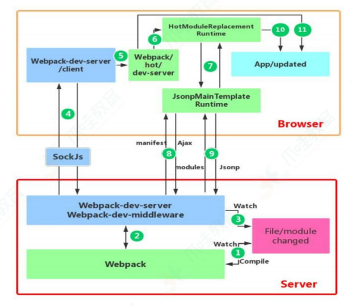

**前端工程化部分**

你是否了解 webpack 的时候，或许你可以说出一串耳熟能详的 webpack loader 和 plugin 的名字，甚至还能说出插件和一系列配置做按需加载和打包优化，那你是否了解他的运行机制以及实现原理呢

## 1. 你知道 webpack 的作用是什么呢？

- **模块打包** 可以将不同模块的文件打包整合在一起，并且保证它们之间的引用正确，执行有序。利用打包我们就可以在开发的时候根据我们自己的业务自由划分文件模块，保证项目结构的清晰和可读性。

- **编译兼容** 在前端的“上古时期”，手写一堆浏览器兼容代码一直是令前端工程师头皮发麻的事情，而在今天这个问题被大大的弱化了，通过 webpack 的 Loader 机制，不仅仅可以帮助我们对代码做 polyfill，还可以编译转换诸如.less,.vue,.jsx 这类在浏览器无法识别的格式文件，让我们在开发的时候可以使用新特性和新语法做开发，提高开发效率。

- **能力扩展** 通过 webpack 的 Plugin 机制，我们在实现模块化打包和编译兼容的基础上，可以进一步实现诸如按需加载，代码压缩等一系列功能，帮助我们进一步提高自动化程度，工程效率以及打包输出的质量。

## 2. 说一下模块打包运行原理？

如果面试官问你 Webpack 是如何把这些模块合并到一起，并且保证其正常工作的，你是否了解呢？

首先我们应该简单了解一下 webpack 的整个打包流程：

1. 读取 webpack 的配置参数
2. 启动 webpack，创建 Compiler 对象并开始解析项目
3. 从入口文件（entry）开始解析，并且找到其导入的依赖模块，递归遍历分析，形成依赖关系树
4. 对不同文件类型的依赖模块文件使用对应的 loader 进行编译，最终转化为 JavaScript 文件
5. 整个过程中 webpack 会通过发布订阅模式，向外抛出一些 hooks，而 webpack 的插件即可通过监听这些关键的事件节点，执行插件任务进而达到干预输出结果的目的

其中文件的解析与构建是一个比较复杂的过程，在 webpack 源码中主要依赖于 compiler 和 compilation 两个核心对象实现。

compiler 对象是一个全局单例，他负责把控整个 webpack 打包的构建流程。compilation 对象是每一次构建的上下文对象，它包含着当次构建所需要的所有信息，每次热更新和重新构建，compiler 都会重新生成一个新的 compilation 对象，负责此次更新的构建过程。

而每个模块间的依赖关系，则依赖于 AST 语法树。每个模块文件在通过 loader 解析完成之后，会通过 acorn 库生成模块代码的 AST 语法树，通过语法树就可以分析这个模块是否还有依赖的模块，进而继续循环执行下一个模块的编译解析。

最终 webpack 打包出来的 bundle 文件是一个 IIFE 的执行函数。

```js
// webpack5 打包的bundle文件内容
(() => {// webpackBootstrap
  var __webpack_modules__ = ({
    'file-A-path': '((modules) => {}),
    'index-file-path': '((__unused_module, __unused_webpack_exports, __webpack_required__) =>{})'
  })

  // the module cache
  var __webpack_module_cache__={};

  // the required function
  function __webpack_required__(moduleId){
    // check if module is in cache
    var cacheModule = __webpack_modules_cache__[moduleId];
    if(cacheModule !== undefined){
      return cacheModule.exports;
    }

    // Create a mew module(and put it into the cache)
    var module = __webpack_modules_cache__[moduleId]={
      // no module.id needed
      // no module.loaded needed
      exports: {}
    };

    // Execute the module function
    __webpack_modules__[moduleId](module, module.exports, __webpack_required__);

    // Return the exports of the module
    return module.exports;
  }

  // start up
  // load entry module and return exports
  // This entry module can't be inlined because the eval devtool is used.
  var __webpack_exports__ = __webpack_required__("./src/index.js");
})
```

和 webpack4 相比，webpack5 打包出来的 bundle 做了相当的精简。在上面的打包 demo 中，整个立即执行函数里边只有三个变量和一个函数方法，**webpack_modules**存放了编译后的各个文件模块的 JS 内容，**webpack_module_cache** 用来做模块缓存，**webpack_require**是 Webpack 内部实现的一套依赖引入函数。最后一句则是代码运行的起点，从入口文件开始，启动整个项目。

其中值得一提的是**webpack_require**模块引入函数，我们在模块化开发的时候，通常会使用 ES Module 或者 CommonJS 规范导出/引入依赖模块，webpack 打包编译的时候，会统一替换成自己的**webpack_require**来实现模块的引入和导出，从而实现模块缓存机制，以及抹平不同模块规范之间的一些差异性。

## 3. webpack 与 grunt、gulp 的不同？

- Grunt、Gulp 是基于任务运行的任务：

它们会自动执行指定的任务，就像流水线，把资源放上去然后通过不同的插件进行加工，它们包含活跃的社区，丰富的插件，能方便打造各种工作流。

- webpack 是基于模块化打包的工具：

自动化处理模块，webpack 把一切当成模块，当 webpack 处理应用程序时，他会递归地构造一个依赖关系图（dependency graph），其中包含应用程序需要的每一个模块，然后将所有这些模块打包成一个或者多个 bundle。

因此这是完全不同的额两类工具，而现在主流的方式是用 npm script 代替 Grunt、Gulp、npm script 同样可以打造任务流。

## 4. webpack、rollup、parcel 优劣？

webpack 适用于大型复杂的前端站点构建： webpack 有强大的 loader 和插件生态，打包后的文件实际上就是一个立即执行函数，这个立即执行函数接收一个参数，这个参数是模块对象，键为各个模块的路径，值为模块内容。立即执行函数内部则处理模块之间的引用，执行模块等，这种情况更适合文件依赖复杂的应用开发。

rollup 适用于基础库的打包，例如： vue、D3 等。Rollup 就是将各个模块打包进一个文件中，并且通过 Tree-shaking 来删除无用的代码，可以最大程度上降低代码体积，但是 rollup 没有 webpack 如此多的高级功能，例如：代码分割、按需加载等，其更聚焦于库的打包，因此更适合库的开发。

parcel 适用于简单的额实验性项目：他可以满足低门槛的快速看到效果，但是生态差、报错信息不够全面都是他的硬伤，除了一些玩具项目或者实验性项目不建议使用。

## 5. 有哪些常用的 Loader？

- file-loader：把文件输出到一个文件夹中，在代码中通过相对 URL 去引用输出额度文件。

- url-loader：和 file-loader 类似，但是能在文件很小的情况下以 base64 的方式把文件内容注入到代码中去。

- source-map-loader:加载额外的 Source Map 文件，以方便断点调试。

- image-loader： 加载并且压缩图片文件。

- babel-loader:把 ES5 转为 ES5。

- css-loader: 加载 css，支持模块化、压缩、文件导入等特性。

- style-loader：把 css 代码注入到 JavaScript 中，通过 DOM 操作去加载 css 文件。

- eslint-loader： 通过 Eslint 检查 JavaScript 代码。

**注意:** 在 webpack 中，loader 的执行顺序是从右到左的。因为 webpack 选择了 compose 这样的函数式编程方式，这种方式的表达式执行时从右到左的。

## 6. 有哪些常见的 Plugin？

- define-plugin：定义环境变量

- html-webpack-plugin：简化 html 文件创建

- uglifyjs-webpack-plugin: 通过 UglifyES 压缩 ES6 代码

- webpack-parallel-uglify-plugin: 多核压缩，提高压缩速度

- webpack-bundle-analyzer: 可视化 webpack 输出文件的体积

- mini-css-extract-plugin: CSS 提取到单独的文件中，支持按需加载

## 7. bundle，chunk，module 是什么？

bundle：是由 webpack 打包出来的⽂件；

chunk：代码块，⼀个 chunk 由多个模块组合⽽成，⽤于代码的合并和分割；

module：是开发中的单个模块，在 webpack 的世界，⼀切皆模块，⼀个模块对应⼀个⽂件，webpack 会从配置的 entry 中递归
开始找出所有依赖的模块。

## 8. Loader 和 Plugin 的区别？

（1）不同作用：

Loader 直译为"加载器"。Webpack 将⼀切⽂件视为模块，但是 webpack 原⽣是只能解析 js ⽂件，如果想将其他⽂件也打包的话，就会⽤到 loader 。 所以 Loader 的作⽤是让 webpack 拥有了加载和解析⾮ JavaScript ⽂件的能⼒。

Plugin 直译为"插件"。Plugin 可以扩展 webpack 的功能，让 webpack 具有更多的灵活性。在 Webpack 运⾏的⽣命周期中会⼴播出许多事件，Plugin 可以监听这些事件，在合适的时机通过 Webpack 提供的 API 改变输出结果。

（2）不同用法：

Loader 在 module.rules 中配置，也就是说它作为模块的解析规则而存在。类型为数组，每一项都是一个 object，里面描述了对于什么类型的文件（test），使用什么加载（loader）和使用的参数（options）。

Plugin 在 plugins 中单独配置。类型为数组，每一项是一个 plugin 的实例，参数都通过构造函数传入。

## 9. webpack 热更新的实现原理？

webpack 的热更新又称为热替换（Hot Module Replacement），缩写为 HMR。这个机制可以做到不用刷新浏览器而将新更新的模块替换掉旧的模块。

原理：



首选要知道 server 端和 client 端都做了处理工作：

（1）在 webpack 的 watch 模式下，文件系统中某个文件发生修改，webpack 监听到文件变化，根据配置文件对模块重新编译打包，并且将打包后的代码通过简单的 JavaScript 对象保存在内存中。

（2）webpack-dev-server 和 webpack 之间的接口交互，而在这一步，主要是 dev-server 的中间 webpack-dev-middleware 和 webpack 之间的交互，webpack-dev-middleware 调用 webpack 暴露的 API 对代码变化进行监控，并且告诉 webpack，将代码打包到内存中。

（3）webpack-dev-server 对文件变化的一个监控，这一步不同于（1），并不是监控代码变化重新打包。当我们在配置文件中配置了 DevServer.watchContentBase 为 true 的时候，Server 会监听这些配置文件夹中静态文件的变化，变化后会通知浏览器端对应用进行 live reload。注意，这儿是浏览器刷新，和 HMR 是两个不同的概念。

（4）webpack-dev-server 代码的工作，该步骤主要是通过 sock.js（webpack-dev-server 的依赖）在浏览器端和服务器端之间建立一个 websocket 长连接，将 webpack 编译打包的各个阶段的状态信息告知浏览器端，同时也包括（3）中 Server 监听静态文件变化的信息。浏览器端根据这些 socket 消息进行不同的操作。当然服务端传递的最主要信息还是新模块的 hash 值，后面的步骤根据这一 hash 值；来进行模块热替换。

webpack-dev-server/client 端并不能请求更新的代码，也不会执行热更新模块操作，而把这些工作又交回给了 webpack，webpack/hot/dev-server 的工作就是根据 webpack-dev-server/client 传给他的信息以及 dev-server 的配置决定是刷新浏览器呢还是进行模块热更新。当然如果仅仅是刷新浏览器，也就没有后面那些步骤了。

HotModuleReplacement.runtime 是客户端 HMR 的中枢，它接收到上⼀ 步 传 递 给 他 的 新 模 块 的 hash 值 ， 它 通 过
JsonpMainTemplate.runtime 向 server 端发送 Ajax 请求，服务端返回⼀个 json，该 json 包含了所有要更新的模块的 hash 值，获
取到更新列表后，该模块再次通过 jsonp 请求，获取到最新的模块代码。这就是上图中 7、8、9 步骤。

⽽第 10 步是决定 HMR 成功与否的关键步骤，在该步骤中，HotModulePlugin 将会对新旧模块进⾏对⽐，决定是否更新模块，在决定更新模块后，检查模块之间的依赖关系，更新模块的同时更新模
块间的依赖引⽤。

最后⼀步，当 HMR 失败后，回退到 live reload 操作，也就是进⾏浏览器刷新来获取最新打包代码。

## 10. Babel 的原理是什么?

babel 的转译过程也分为三个阶段，这三步具体是：

（1）**解析 Parse**: 将代码解析⽣成抽象语法树（AST），即词法分析与语法分析的过程；

（2）**转换 Transform**: 对于 AST 进⾏变换⼀系列的操作，babel 接受得到 AST 并通过 babel-traverse 对其进⾏遍历，在此过程中进⾏添加、更新及移除等操作；

（3）**⽣成 Generate**: 将变换后的 AST 再转换为 JS 代码, 使⽤到的模块是 babel-generator。


## 11. git 和 svn 的区别？

git 和 svn 最大的区别在于 git 是分布式的，而 svn 是集中式的。因此我们不能再离线的情况下使用 svn。如果服务器出现问题，就没有办法使用 svn 来提交代码。

svn 中的分支是整个版本库的复制的一份完整目录，而 git 的分支是指针指向某次提交，因此 git 的分支创建更加开销更小并且分支上的变化不会影响到其他人。svn 的分支变化会影响到所有的人。
svn 的指令相对于 git 来说要简单一些，比 git 更容易上手。

GIT 把内容按元数据方式存储，而 SVN 是按文件：因为 git 目录是处于个人机器上的一个克隆版的版本库，它拥有中心版本库上所有的东西，例如标签，分支，版本记录等。

GIT 分支和 SVN 的分支不同：svn 会发生分支遗漏的情况，而 git 可以同一个工作目录下快速的在几个分支间切换，很容易发现未被合并的分支，简单而快捷的合并这些文件。

GIT 没有一个全局的版本号，而 SVN 有 GIT 的内容完整性要优于 SVN：GIT 的内容存储使用的是 SHA-1 哈希算法。这能确保代码内容的完整性，确保在遇到磁盘故障和网络问题
时降低对版本库的破坏。

## 12. 你知道 sourceMap 是什么吗？

提到 sourceMap，很多小伙伴可能会立刻想到 Webpack 配置里边的 devtool 参数，以及对应的 eval，eval-cheap-source-map 等等可选值以及它们的含义。除了知道不同参数之间的区别以及性能上的差异外，我们也可以一起了解一下 sourceMap 的实现方式。

sourceMap 是一项将编译、打包、压缩后的代码映射回源代码的技术，由于打包压缩后的代码并没有阅读性可言，一旦在开发中报错或者遇到问题，直接在混淆代码中 debug 问题会带来非常糟糕的体验，sourceMap 可以帮助我们快速定位到源代码的位置，提高我们的开发效率。sourceMap 其实并不是 Webpack 特有的功能，而是 Webpack 支持 sourceMap，像 JQuery 也支持 sourceMap。

既然是一种源码的映射，那必然就需要有一份映射的文件，来标记混淆代码里对应的源码的位置，通常这份映射文件以.map 结尾，里边的数据结构大概长这样：

```js
{
  "version" : 3,                          // Source Map版本
  "file": "out.js",                       // 输出文件（可选）
  "sourceRoot": "",                       // 源文件根目录（可选）
  "sources": ["foo.js", "bar.js"],        // 源文件列表
  "sourcesContent": [null, null],         // 源内容列表（可选，和源文件列表顺序一致）
  "names": ["src", "maps", "are", "fun"], // mappings使用的符号名称列表
  "mappings": "A,AAAB;;ABCDE;"            // 带有编码映射数据的字符串
}
```

其中 mappings 数据有如下规则：

- 生成文件中的一行的每个组用“；”分隔；
- 每一段用“，”分隔；
- 每个段由 1、4 或者 5 个可变长长度字段组成

有了这份映射文件，我们只需要在我们的压缩代码的最末端加上这句注释，即可让 sourceMap 生效：

```js
//# sourceURL=/path/to/file.js.map
```

有了这段注释后，浏览器就会通过 sourceURL 去获取这份映射文件，通过解释器解析后，实现源码和混淆代码之间的映射。因此 sourceMap 其实也是一项需要浏览器支持的技术。

如果我们仔细查看 webpack 打包出来的 bundle 文件，就可以发现在默认的 development 开发模式下，每个\_webpack_modules\_\_文件模块的代码最末端，都会加上//# sourceURL=webpack://file-path?，从而实现对 sourceMap 的支持。

### 13. 是否写过 Loader？简单描述一下编写 loader 的思路？

从上面的打包代码我们其实可以知道：webpack 最后打包出来的成果是一份 JavaScript 代码，实际上在 webpack 内部默认也只能处理 JS 模块代码，在打包过程中，会默认把所有遇到的文件都当做 JavaScript 代码进行解析，因此当项目存在非 JS 类型文件时，我们需要先对其进行必要的转换，才能继续执行打包任务，这也是 loader 机制存在的意义。

Loader 的配置使用我们应该非常熟悉：

```js
// webpack.config.js
module.exports = {
  // ...other config
  module: {
    rules: [
      {
        test: /^your-regExp$/,
        use: [
          {
            loader: 'loader-name-A',
          },
          {
            loader: 'loader-name-B',
          },
        ],
      },
    ],
  },
};
```

通过配置可以看出，针对每个文件类型，loader 是支持以数组的形式配置多个的，因此当 Webpack 在转换该文件类型的时候，会按顺序链式调用每一个 loader，前一个 loader 返回的内容会作为下一个 loader 的入参。因此 loader 的开发需要遵循一些规范，比如返回值必须是标准的 JS 代码字符串，以保证下一个 loader 能够正常工作，同时在开发上需要严格遵循“单一职责”，只关心 loader 的输出以及对应的输出。

Loader 函数中的 this 上下文由 webpack 提供，可以通过 this 对象提供的相关属性，获取当前 loader 需要的各种信息数据，事实上，这个 this 指向了一个叫 loaderContext 的 loader-runner 特有对象。有兴趣的伙伴可以自行阅读源码。

```js
module.exports = function (source) {
  const content = doSomeThing2JsString(source);

  // 如果 loader 配置了 options 对象，那么this.query将指向 options
  const options = this.query;

  // 可以用作解析其他模块路径的上下文
  console.log('this.context');

  /*
   * this.callback 参数：
   * error：Error | null，当 loader 出错时向外抛出一个 error
   * content：String | Buffer，经过 loader 编译后需要导出的内容
   * sourceMap：为方便调试生成的编译后内容的 source map
   * ast：本次编译生成的 AST 静态语法树，之后执行的 loader 可以直接使用这个 AST，进而省去重复生成 AST 的过程
   */
  this.callback(null, content);
  // or return content;
};
```

更详细的开发文档可以直接查看官网的 [Loader API](https://www.webpackjs.com/api/loaders/)。

### 14. 是否写过 Plugin？简单描述一下编写 plugin 的思路？

如果说 Loader 负责文件转换，那么 Plugin 便是负责功能扩展。Loader 和 Plugin 作为 Webpack 的两个重要组成部分，承担着两部分不同的职责。

上文已经说过，webpack 基于发布订阅模式，在运行的生命周期中会广播出许多事件，插件通过监听这些事件，就可以在特定的阶段执行自己的插件任务，从而实现自己想要的功能。

既然基于发布订阅模式，那么知道 Webpack 到底提供了哪些事件钩子供插件开发者使用是非常重要的，上文提到过 compiler 和 compilation 是 Webpack 两个非常核心的对象，其中 compiler 暴露了和 Webpack 整个生命周期相关的钩子（compiler-hooks），而 compilation 则暴露了与模块和依赖有关的粒度更小的事件钩子（Compilation Hooks）。

Webpack 的事件机制基于 webpack 自己实现的一套 Tapable 事件流方案:

```js
// taapable的简单使用
const { SyncHook } = required('tapable');

class Car {
  construct() {
    // 在this.hooks中定义所有的钩子事件
    this.hooks = {
      accelerate: new SyncHook(['newSpeed']),
      brake: new SyncHook(),
      calculateRoutes: new AsyncParallelHook([
        'source',
        'target',
        'routesList',
      ]),
    };
  }
}

const myCar = new Car();
// 通过调用tap方法即可添加一个消费者，订阅对应的钩子事件

myCar.hooks.brake.tap('WarningLampPlugin', () => warningLamp.on());
```

Plugin 的开发和开发 Loader 一样，需要遵循一些开发上的规范和原则：

- 插件必须是一个函数或者是一个包含 apply 方法的对象，这样才能访问 compiler 实例；
- 传给每个插件的 compiler 和 compilation 对象都是同一个引用，若在一个插件中修改了它们身上的属性，会影响后面的插件;
- 异步的事件需要在插件处理完任务时调用回调函数通知 Webpack 进入下一个流程，不然会卡住;

了解了以上这些内容，想要开发一个 Webpack Plugin，其实也并不困难。

```js
class MyPlugin {
  apply(compiler) {
    // 找到合适的事件钩子，实现自己的插件功能
    compiler.hooks.emit.tap('MyPlugin', (compilation) => {
      // compilation: 当前打包构建流程的上下文
      console.log(compilation);

      // do something...
    });
  }
}
```

更详细的开发文档可以直接查看官网的 [Plugin API](https://www.webpackjs.com/api/plugins/)。

## 参考链接

- [Webpack](https://webpack.docschina.org/blog/2020-10-10-webpack-5-release/)
- [「吐血整理」再来一打 Webpack 面试题](https://juejin.cn/post/6844904094281236487#heading-0)
- [Source Map 的原理探究](https://blog.fundebug.com/2018/10/12/understanding_frontend_source_map/)
- [构建 webpack5 知识体系【近万字总结】](https://juejin.cn/post/7062899360995999780#heading-62)
