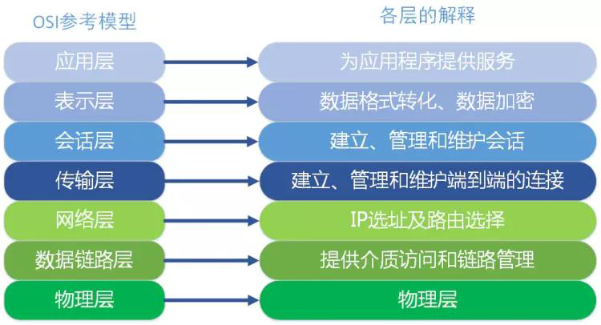
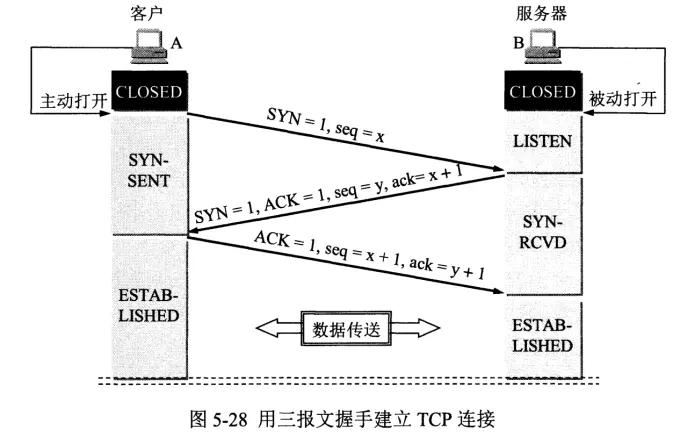
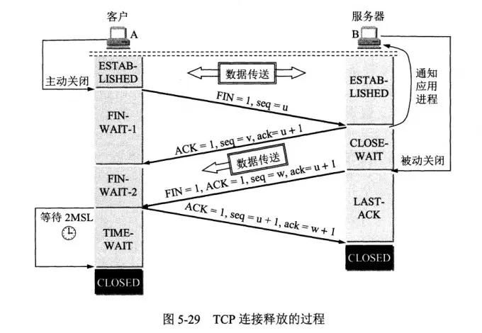

**计算机网路基础知识总结**

## 1.GET 和 POST 的请求区别：

首先，都是 http 的请求方式。区别如下：

（1）**应用场景不同**

GET 请求是一个幂等的请求，一般 GET 请求用于对服务器资源不会产生影响的场景，比如说请求一个网页的资源。

POST 不是一个幂等的请求，一般用于对服务器资源会产生影响的场景，比如注册用户这一类的操作。

（2）**是否缓存**

因为两者应用场景不同，浏览器一般会对 GET 请求缓存，但是很少对 POST 请求缓存。

（3）**发送报文格式不同**

GET 请求的报文中实体部分为空。POST 请求的报文中实体部分一般为服务器发送的数据。

（4）**安全性不同**

GET 请求可以将请求的参数放到 url 中向服务器发送，这样子的做法相对于 POST 来说不太安全，因为请求的 url 会被保留在历史记录中。

（5）**请求长度不同**

浏览器由于对 url 长度的限制，所以会影响 get 请求发送数据的长度。这个限制是浏览器规定的，并不是 RFC 规定的。

（6）**参数类型不同**

参数类型：POST 的参数传递支持更多的数据类型。

## 2. POST 和 PUT 的区别

PUT 请求是向服务器端发送数据，从而修改数据的内容，但是不会增加数据的种类等，也就是说无论进行多少次 PUT 操作，其结果并没有不同。（可以理解为时更新数据）

POST 请求是向服务器端发送数据，该请求会改变数据的种类等资源，它会创建新的内容。（可以理解为是创建数据）

## 3. 常见的 HTTP 请求头和响应头

**HTTP Request Header 常见的请求头**：

Accept:浏览器能够处理的内容类型

Accept-Charset:浏览器能够显示的字符集

Accept-Encoding：浏览器能够处理的压缩编码

Accept-Language：浏览器当前设置的语言

Connection：浏览器与服务器之间连接的类型

Cookie：当前页面设置的任何 Cookie

Host：发出请求的页面所在的域

Referer：发出请求的页面的 URL

User-Agent：浏览器的用户代理字符串

HTTP Responses Header

**常见的响应头：**

Date：表示消息发送的时间，时间的描述格式由 rfc822 定义

server:服务器名称

Connection：浏览器与服务器之间连接的类型

Cache-Control：控制 HTTP 缓存

content-type:表示后面的文档属于什么 MIME 类型

**常见的 Content-Type 属性值有以下四种**：

（1）application/x-www-form-urlencoded：浏览器的原生 form 表单， 如果不设置 enctype 属性， 那么最终就会以 application/x-www-form-urlencoded 方式提交数据。该种方式提交的数据放在 body 里面，数据按照 key1=val1&key2=val2 的方式进行编码，key 和 val 都进行了 URL 转码。

（2）multipart/form-data：该种方式也是一个常见的 POST 提交方式，通常表单上传文件时使用该种方式。

（3）application/json：服务器消息主体是序列化后的 JSON 字符串。

（4）text/xml：该种方式主要用来提交 XML 格式的数据。

## 4. OSI 七层模型

ISO 为了更好的使用网络应用更为普及，推出了 OSI 参考模型

（1）应用层

OSI 参考模型中**最靠近用户的一层**，是**为了计算机用户提供应用接口**，也**为用户直接提供各种网络服务**。我们常见应用层额度网络服务协议有：HTTPS、HTTP、FTP、POP3、SMTP 等。

在客户端与服务器中经常会有数据的请求，这个时候就是会用到 http（hyper text transfer protocol）（超文本传输协议）或者 https.在后端设计数据接口时，我们常常使用到这个协议。

FTP 是文件传输协议，在一些资源网站，比如“百度网盘”、“迅雷”是基于这个协议。

SMTP 是 simple mail transfer protocol （简单邮件传输协议）。在一个项目中，在用户邮件验证码登录的功能时，使用到了这个协议。

（2）表示层

表示层是**提供各种应用层数据的编码和转换功能**，确保一个系统的应用层发送的数据能被另一个系统的应用层识别。如果必要，该层可以提供一种标准表示形式，用于计算机内部的多种数据格式转换为通信中采用的标准表示形式。数据压缩和加密也是表示层可提供的转换功能之一。

在项目开发中，为了方便数据传输，可以使用 BASE64 对数据包进行编码、解码。如果按功能来划分，BASE64 应用是工作在表示层。

（3）会话层

会话层就是**负责建立、管理和终止表示层实体之间的通信会话**。该层的通信由不同设备中的应用程序之间的服务请求和响应组成。

（4）传输层

传输层建立了主机端到端的链接，传输层的作用是**为上层协议提供端到端的可靠和透明的数据传输服务**，包括处理差错控制和流量控制等问题。该层向高层屏蔽了下层数据通信的细节，使得高层用户看到的只是在两个传输实体间的一条主机到主机的、可由用户控制和设定的。可靠的数据通路。我们通常说的，**TCP UDP 就是在传输层，端口号就是这里的“端”。**

（5）网络层（IP 层/IP 协议层）

本层通过 IP 寻址来建立两个节点之间的连接，为源端的传输层送来的分组，选择合适的路由和交换节点，正确无误地按照地址传送给目的端的运输层。**IP 协议是 Internal 是基础**。

我们可以理解为：**网络层规定了数据包的传输路线，而传输层则规定了数据包的传输方式**。

（6）数据链路层

将比特组合成字节，再将字节组合成帧，使用链路层地址（以太网使用 MAC 地址）来访问介质，并进行差错检测。

网络层与数据链路层的对比，通过上面的描述，我们或许可以这样理解：**网络层是规划了数据包的传输路线，而数据链路层就是传输路线。不过，在数据链路层上还增加了差错控制的功能**。

（7）物理层

实际最终信号的传输是通过物理层实现的。通过物理介质传输比特流。规定了电平、速度和电缆针脚。常用设备有（各种物理设备）集线器、中继器、调制解调器、网线、双绞线、同轴电缆。这些都是物理层的传输介质。

OSI 七层模型通信的特点：对等通信。

对等通信，为了使数据分组从源传送到目的地，源端 OSI 模型的每一层都必须与目的端的对等层进行通信，这种通信方式称为对等层通信。

在每一层通信过程中，使用本层自己协议进行通信。

## 5. TCP 的三次握手和四次挥手

（1）**三次握手**

三次握手，其实就是建立一个 TCP 连接时，需要客户端和对服务器总共发送 3 个包，进行三次握手的主要作用是\*\*为了确认双方的接收能力和发送能力是否正常、指定自己的初始化序列号为后面的可靠传送做准备。实质上就是连接服务器指定端口，建立 TCP 连接，并同步连接双方的序列号和确认号，交换 TCP 窗口大小信息。

刚开始客户端处于 closed 的状态，服务端处于 Listen 状态。

**第一次握手**：客户端给服务端发一个 SYN 报文，并指明客户端的初始化序列号 ISN，此时客户端处于 SYN_SEND 状态。

首部的同步位 SYN=1，初始序号 seq=x，SYN=1 的报文段不能携带数据，但要消耗掉一个序号。

**第二次握手**：服务器收到客户端的 SYN 报文之后，会以自己的 SYN 报文作为应答，并且也是指定了自己的初始化序列号 ISN。同时会把客户端的 ISN +1 作为 ACK 的值，表示自己已经收到了客户端的 SYN，此时服务器处于 SYN_REVD 的状态。

在确认报文中 SYN=1，ACK=1，确认号 ack=x+1，初始序号 seq=y。

**第三次握手**：客户端收到 SYN 报文之后，会发送一个 ACK 报文，当然，也是一样把服务器的 ISN+1 作为 ACK 的值，表示已经收到了服务端的 SYN 报文，此时客户端处于 ESTABLISHED 状态。服务器收到 ACK 报文之后，也处于 ESTABLISHED 状态，此时，双方已建立起了连接。

确认报文段 ack=1，确认号 ack=y+1，序号 seq=x+1（初始为 seq=x，第二个报文段所以要+1），ack 报文段可以携带数据，不携带数据则不消耗序号。

那为什么要三次握手？

为了确认双方的接收能力和发送能力都正常，如果是用两次握手，则会出现下面这种情况：

如客户端发出连接请求，但是因连接请求报文丢失而未收到确认，于是客户端再重传一次连接请求。后来收到了确认，建立了连接。数据传输完毕后，就释放了连接，客户端共发出了两个连接请求报文段，其中第一个丢失，第二个到达了服务端，但是第一个丢失的报文段只是在某些网络节点长时间滞留了，延误到连接释放了以后的某个时间才到达服务器，此时服务端误认为客户端又发出了一次新的连接请求，于是就向客户端发出确认，就建立了新的连接了，此时客户端忽略服务端发来的确认，也不发送数据，则服务器一致等待客户端发送数据，浪费资源。

简单来说就是以下三步：

第一次握手：客户端向服务端发送连接请求报文段。该报文段中包含自身的数据通讯初始序号。请求发送后，客户端便进入 SYN-SENT 状态。

第二次握手：服务端收到连接请求报文段后，如果同意连接，则会发送一个应答，该应答中也会包含自身的数据通讯初始序号，发送完成后便进入 SYN-RECEIVED 状态。

第三次握手：当客户端收到连接同意的应答后，还要向服务端发送一个确认报文。客户端发完这个报文段后便进入 ESTABLISHED 状态，服务端收到这个应答后也进入 ESTABLISHED 状态，此时连接建立成功。

（2）**四次挥手**

刚开始双方都处于 ESTABLISHED 状态，假如是客户端先发起关闭请求。4 次挥手的过程如下：

**第一次挥手**：客户端会发送一个 FIN 报文，报文中指定一个序列号。此时客户端处于 FIN_WAIT1 状态。

即发出连接释放报文段（FIN=1，序号 seq=u），并停止再发送数据，主动关闭 TCP 连接，进入 FIN_WAIT1（终止等待 1）状态，等待服务端的确认。

**第二次挥手**： 服务端收到 FIN 之后，会发送 ACK 报文，且把客户端的序列号值+1 作为 ACK 报文的序列号值，表明已经收到客户端的报文了，此时服务端处于 CLOSE_WAIT 状态。

即服务端收到连接释放报文段后即发出确认报文段（ACK=1，确认号 ack=u+1，序号 seq=v），服务端进入 CLOSE_WAIT（关闭等待）状态，此时的 TCP 处于半关闭状态，客户端到服务端的连接释放。客户端收到服务端的确认后，进入 FIN_WAIT2（终止等待 2）状态，等待服务端发出的连接释放报文段。

**第三次挥手**：如果服务端也想断开连接了，和客户端的第一次挥手一样，发给 FIN 报文，且指定一个序列号。此时服务端处于 LAST_ACK 的状态。

即服务端没有要向客户端发出的数据，服务端发出连接释放报文段（FIN=1，ACK=1，序号 seq=w，确认号 ack=u+1），服务端进入 LAST_ACK（最后确认）状态，等待客户端的确认。

**第四次挥手**：客户端收到 FIN 之后，一样发送一个 ACK 报文作为应答，且把服务端的序列号值+1 作为自己 ACK 报文的序列号值，此时客户端处于 TIME_WAIT 状态。需要过一阵子以确保服务端收到自己的 ACK 报文之后才会进入 CLOSED 状态，服务端收到 ACK 报文之后，就处于关闭连接了，处于 CLOSED 状态。

即客户端收到服务端的连接释放报文段后，对此发出确认报文段（ACK=1，seq=u+1，ack=w+1），客户端进入 TIME_WAIT（时间等待）状态。此时 TCP 未释放掉，需要经过时间等待计时器设置的时间 2MSL 后，客户端才进入 CLOSED 状态。

**那为什么需要四次挥手呢？**

因为当服务器收到客户端的 SYN 连接请求报文后，可以直接发送 SYN+ACK 报文。其中 ACK 报文是用来应答的，SYN 报文是用来同步的。但是关闭连接时，当服务器收到 FIN 报文时，很可能并不会立即关闭 SOCKET，所以只能先回复一个 ACK 报文，告诉客户端，“你发的 FIN 报文我收到了”。只有等待我服务器所有的报文都发送完了，我才能发送 FIN 报文，因此不能一起发送，故需要四次挥手。

简单来说就是以下四步：
第一次挥手：若客户端认为数据发送完成，则它需要向服务端发送连接释放请求。

第二次挥手：服务端收到连接释放请求后，会告诉应用层要释放 TCP 链接。然后会发送 ACK 包，并进入 CLOSE_WAIT 状态，此时表明客户端到服务端的连接已经释放，不再接收客户端发的数据了。但是因为 TCP 连接是双向的，所以服务端仍旧可以发送数据给客户端。

第三次挥手：服务端如果此时还有没发完的数据会继续发送，完毕后会向客户端发送连接释放请求，然后服务端便进入 LAST-ACK 状态。

第四次挥手：客户端收到释放请求后，向服务端发送确认应答，此时客户端进入 TIME-WAIT 状态。该状态会持续 2MSL（最大段生存期，指报文段在网络中生存的时间，超时会被抛弃） 时间，若该时间段内没有服务端的重发请求的话，就进入 CLOSED 状态。当服务端收到确认应答后，也便进入 CLOSED 状态。

TCP 使用四次挥手的原因是因为 TCP 的连接是全双工的，所以需要双方分别释放到对方的连接，单独一方的连接释放，只代表不能再向对方发送数据，连接处于的是半释放的状态。

最后一次挥手中，客户端会等待一段时间再关闭的原因，是为了防止发送给服务器的确认报文段丢失或者出错，从而导致服务器端不能正常关闭。
